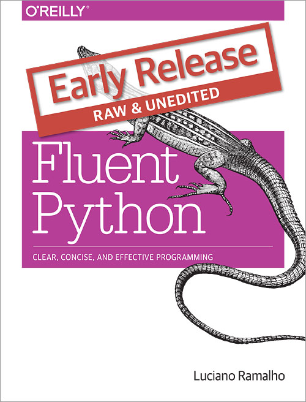

=======================================================
Exemplos para palestras baseadas no livro Fluent Python
=======================================================

*Ramalho, L.* — `Fluent Python`_ (O'Reilly, 2014)

.. _Fluent Python: http://shop.oreilly.com/product/0636920032519.do

Palestras
=========

- `GruPy-SP`_: Grupo de Usuários de Python — São Paulo, 24/jan/2015

