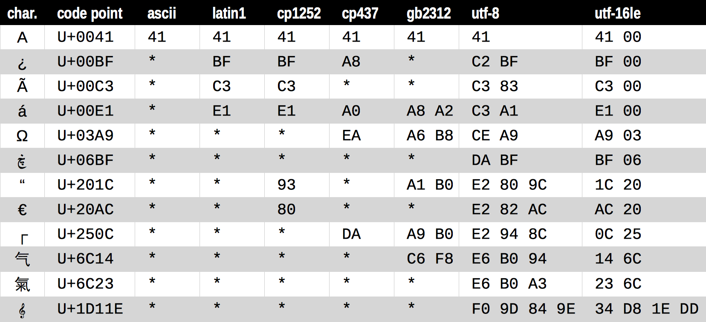
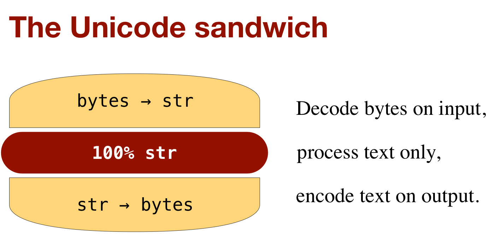

==================
Texto versus bytes
==================

    Humanos usam texto. Computadores falam bytes.

    *Esther Nam e Travis Fisher* — `Character encoding and Unicode in Python`_

.. _Character encoding and Unicode in Python: http://www.slideshare.net/fischertrav/character-encoding-unicode-how-to-with-dignity-33352863

Para motivar a discussão
========================

Execute o script `codepages_anim.py`_

.. _codepages_anim.py: codepages_anim.py

Encoding versus decoding
========================

::

    >>> s = 'café'
    >>> len(s)
    4
    >>> b = s.encode('utf8')
    >>> b
    b'caf\xc3\xa9'
    >>> len(b)
    5
    >>> b.decode('utf8')

Tipos binários
==============

Tipos ``bytes`` e ``bytearray``

::

    >>> cafe = bytes('café', encoding='utf_8')
    >>> cafe
    b'caf\xc3\xa9'
    >>> cafe[0]
    99
    >>> cafe[:1]
    b'c'
    >>> cafe_arr = bytearray(cafe)
    >>> cafe_arr
    bytearray(b'caf\xc3\xa9')
    >>> cafe_arr[-1:]
    bytearray(b'\xa9')

Construtor alternativo

::

    >>> bytes.fromhex('31 4B CE A9')
    b'1K\xce\xa9'

Codecs
======

Codecs: encoders, decoders

::

    >>> for codec in ['latin_1', 'utf_8', 'utf_16']:
    ...     print(codec, 'El Niño'.encode(codec), sep='\t')
    ...
    latin_1 b'El Ni\xf1o'
    utf_8   b'El Ni\xc3\xb1o'
    utf_16  b'\xff\xfeE\x00l\x00 \x00N\x00i\x00\xf1\x00o\x00'

Codecs notáveis:

``latin1``
    Também conhecido como ``iso8859_1``: idiomas da Europa ocidental.

``cp1252``
    Extensão do ``latin1`` criada pela Microsoft. Erroneamente chamado de "ANSI".

``cp437``
    Página de código original do IBM PC-DOS com caracteres para desenhar bordas, porém faltando letras maiúsculas acentuadas.

``cp850``
    Página de código derivada da ``cp437`` completando as letras maiúsculas acentuadas (no lugar de alguns caracteres de bordas)

``gb2312``
    Codificação multi-byte Chinesa: obsoleta mas ainda largamente utilizada.

``utf-8``
    Codificação de 8 bits usando 1 a 4 bytes por caractere, recomendada pelo W3C e usada em cerca de 80% dos sites da Web hoje. Parte da norma Unicode.

``utf-16le``
    Codificação de 16 bits usando 2 a 4 bytes por caractere. Parte da norma Unicode.

``ucs-2``
    Codificação de 16 bits usando 2 bytes por caractere. Obsoleta desde 1996.

Diagnosticar e resolver erros
=============================

``UnicodeEncodeError``

::

    >>> city = 'São Paulo'
    >>> city.encode('utf_8')
    b'S\xc3\xa3o Paulo'
    >>> city.encode('utf_16')
    b'\xff\xfeS\x00\xe3\x00o\x00 \x00P\x00a\x00u\x00l\x00o\x00'
    >>> city.encode('iso8859_1')
    b'S\xe3o Paulo'
    >>> city.encode('cp437')
    Traceback (most recent call last):
      File "<stdin>", line 1, in <module>
      File "/.../lib/python3.4/encodings/cp437.py", line 12, in encode
        return codecs.charmap_encode(input,errors,encoding_map)
    UnicodeEncodeError: 'charmap' codec can't encode character '\xe3' in
    position 1: character maps to <undefined>
    >>> city.encode('cp437', errors='ignore')
    b'So Paulo'
    >>> city.encode('cp437', errors='replace')
    b'S?o Paulo'
    >>> city.encode('cp437', errors='xmlcharrefreplace')
    b'S&#227;o Paulo'

``UnicodeDecodeError``

::

    >>> octets = b'Montr\xe9al'
    >>> octets.decode('cp1252')
    'Montréal'
    >>> octets.decode('iso8859_7')
    'Montrιal'
    >>> octets.decode('koi8_r')
    'MontrИal'
    >>> octets.decode('utf_8')
    Traceback (most recent call last):
      File "<stdin>", line 1, in <module>
    UnicodeDecodeError: 'utf-8' codec can't decode byte 0xe9 in position 5:
    invalid continuation byte
    >>> octets.decode('utf_8', errors='replace')
    'Montr�al'

``SyntaxError``

::

    SyntaxError: Non-UTF-8 code starting with '\xe1' in file ola.py on line
    1, but no encoding declared; see http://python.org/dev/peps/pep-0263/
    for details

::

    # coding: cp1252

    print('Olá, Mundo!')

Detectando encodings: Chardet
=============================

Pacote `chardet`_ (Universal Character Encoding Detector).

.. _chardet: https://pypi.python.org/pypi/chardet

Pode ser usado como biblioteca ou utilitário de linha de comando.

::

    $ chardetect Strings-bytes.asciidoc
    Strings-bytes.asciidoc: utf-8 with confidence 0.99

Arquivos de texto
=================

Use o sanduíche: recheio 100% Unicode puro!

Não confie nos encodigns default.

::

    >>> open('cafe.txt', 'w', encoding='utf_8').write('café')
    4
    >>> open('cafe.txt').read()
    'café'

Para entender o que se passa

::

    >>> fp = open('cafe.txt', 'w', encoding='utf_8')
    >>> fp
    <_io.TextIOWrapper name='cafe.txt' mode='w' encoding='utf_8'>
    >>> fp.write('café')
    4
    >>> fp.close
    >>> import os
    >>> os.stat('cafe.txt').st_size
    5
    >>> fp2 = open('cafe.txt')
    >>> fp2
    <_io.TextIOWrapper name='cafe.txt' mode='r' encoding='cp1252'>
    >>> fp2.encoding
    'cp1252'
    >>> fp2.read()
    'café'
    >>> fp3 = open('cafe.txt', encoding='utf_8')
    >>> fp3
    <_io.TextIOWrapper name='cafe.txt' mode='r' encoding='utf_8'>
    >>> fp3.read()
    'café'
    >>> fp4 = open('cafe.txt', 'rb')
    >>> fp4
    <_io.BufferedReader name='cafe.txt'>
    >>> fp4.read()
    b'caf\xc3\xa9'

A *zona* dos encodings default
==============================

Script para investigação: `default_encodings.py`_

.. _default_encodings.py: default_encodings.py

GNU/Linux Ubuntu 14.04, Mac OSX 10.9

::

    $ python3 default_encodings.py
     locale.getpreferredencoding() -> 'UTF-8'
                     type(my_file) -> <class '_io.TextIOWrapper'>
                  my_file.encoding -> 'UTF-8'
               sys.stdout.isatty() -> True
               sys.stdout.encoding -> 'UTF-8'
                sys.stdin.isatty() -> True
                sys.stdin.encoding -> 'UTF-8'
               sys.stderr.isatty() -> True
               sys.stderr.encoding -> 'UTF-8'
          sys.getdefaultencoding() -> 'utf-8'
       sys.getfilesystemencoding() -> 'utf-8'

Windows 7, SP1

::

    Z:\>chcp
    Página de código ativa: 850
    Z:\>python default_encodings.py
     locale.getpreferredencoding() -> 'cp1252'
                     type(my_file) -> <class '_io.TextIOWrapper'>
                  my_file.encoding -> 'cp1252'
               sys.stdout.isatty() -> True
               sys.stdout.encoding -> 'cp850'
                sys.stdin.isatty() -> True
                sys.stdin.encoding -> 'cp850'
               sys.stderr.isatty() -> True
               sys.stderr.encoding -> 'cp850'
          sys.getdefaultencoding() -> 'utf-8'
       sys.getfilesystemencoding() -> 'mbcs'

Ordem alfabética
================

Ordenação default: por codepoint.

::

    >>> fruits = ['caju', 'atemoia', 'cajá', 'açaí', 'acerola']
    >>> sorted(fruits)
    ['acerola', 'atemoia', 'açaí', 'caju', 'cajá']

Ordenação com ``locale.strxfrm``

::

    >>> import locale
    >>> locale.setlocale(locale.LC_COLLATE, 'pt_BR.UTF-8')
    'pt_BR.UTF-8'
    >>> fruits = ['caju', 'atemoia', 'cajá', 'açaí', 'acerola']
    >>> sorted_fruits = sorted(fruits, key=locale.strxfrm)
    >>> sorted_fruits
    ['açaí', 'acerola', 'atemoia', 'cajá', 'caju']

Ordenação com pacote `pyuca`_: Unicode Collation Algorithm

.. _pyuca: https://pypi.python.org/pypi/pyuca/

::

    >>> import pyuca
    >>> coll = pyuca.Collator()
    >>> fruits = ['caju', 'atemoia', 'cajá', 'açaí', 'acerola']
    >>> sorted_fruits = sorted(fruits, key=coll.sort_key)
    >>> sorted_fruits
    ['açaí', 'acerola', 'atemoia', 'cajá', 'caju']

Outros tópicos abordados no livro
=================================

Além desses assuntos, o capítulo 4 *"Text versus bytes"* do `Fluent Python`_ cobre:

* manipulação de bytes com ``array.array``, ``memoryview`` e ``struct``
* codificações com BOM (byte-order mark)
* normalização de texto Unicode para comparação e indexação
* o que faz o método ``str.casefold()``
* exemplos de código: normalização e remoção de acentos
* identificação de dígitos não-ASCII
* expressões regulares com ``str`` e ``bytes``
* funções do módulo ``os`` que aceitam ``str`` ou ``bytes``
* **muitas** referências: vídeos, blogs, slides, livros, padrões oficiais...

.. _Fluent Python: http://shop.oreilly.com/product/0636920032519.do

----

Voltar_

.. _Voltar: README.rst
